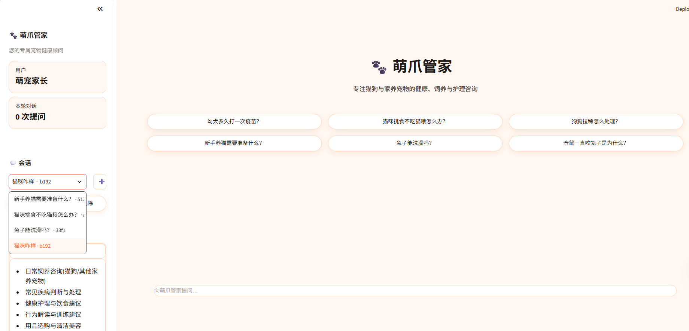
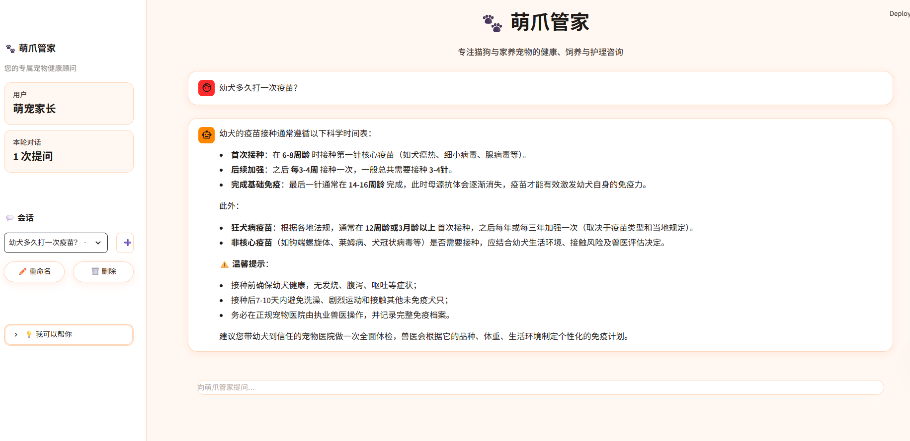
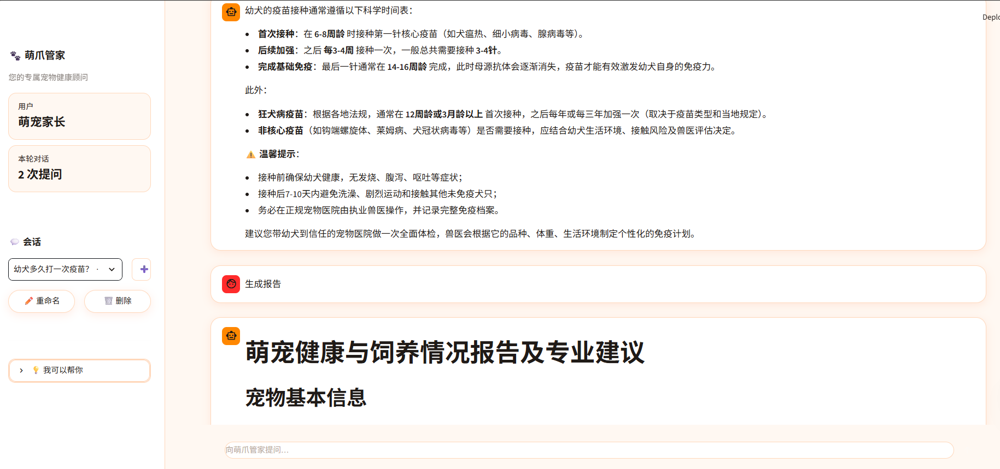

# 🐾 萌爪管家

> 一个面向养宠人群(猫狗为主、兼顾其他常见家养宠物)的智能客服项目,基于 **RAG + ReAct Agent** 架构,Streamlit 前端,接入真实天气与外部使用数据。

---

## 📖 项目简介

**萌爪管家** 是一个"会思考、会查资料、会读外部数据"的宠物顾问:

- **不是关键词匹配**:接 LangChain ReAct Agent,能根据用户问题自主决定"调什么工具 / 怎么调"
- **不是固定话术**:每次回答基于向量库检索 + LLM 综合,知识库覆盖 4 份养宠资料(共 600+ 条)
- **不只是问答**:支持"生成我的本月宠物使用报告",会自动调用外部数据接口做汇总
- **不只是离线**:接 wttr.in 真实天气,中英文城市名,带城市/宠物的环境化建议

---

## ✨ 功能展示

### 1. 空状态首页(无历史对话)

进入应用时,主页会展示 6 个高频问题的推荐胶囊,点击即提问。



**侧栏能力一览**:
- 用户身份卡(用户 / 本轮对话)
- 多会话管理(下拉框切换 / ➕ 新建 / ✏️ 重命名 / 🗑️ 删除)
- "我可以帮你" 折叠说明

### 2. 日常问答页

点击推荐问题后,智能客服会先思考、再调 RAG 工具检索、最后用结构化中文回答。



支持的咨询类型:
- 🐶 日常饲养(幼犬多久打疫苗 / 幼猫怎么喂)
- 🐱 健康问题(拉稀 / 呕吐 / 食欲不振)
- 🛒 用品选购(猫砂 / 狗粮 / 玩具)
- ✂️ 美容清洁(洗澡频次 / 指甲修剪)
- 🐰 其他家养宠物(兔子 / 仓鼠 / 龟)

### 3. 月度使用报告

对客服说"给我生成我的本月使用报告",会自动切换到报告 prompt,走以下流程:

```
获取用户ID → 获取当前月份 → fetch_external_data 拉取数据 → 生成结构化报告
```



报告基于 `data/external/records.csv` 中 10 个用户、12 个月的使用记录,内容包含宠物基本信息、健康/饮食/活动等维度。

---

## 🏗️ 技术架构

```
┌─────────────────────────────────────────────────────────────┐
│                       Streamlit 前端 (app.py)                │
│  侧栏 │ 多会话 │ 主题样式 │ 聊天消息渲染 │ 流式输出            │
└─────────────────────────────────────────────────────────────┘
                              │
                              ▼
┌─────────────────────────────────────────────────────────────┐
│                   ReAct Agent (LangGraph)                   │
│  middleware: monitor_tool │ log_before_model │ report_prompt  │
│  tools:                                                     │
│   - rag_summarize    →  RAG 检索                            │
│   - get_weather      →  wttr.in 真实天气                    │
│   - get_user_id      →  当前用户(模拟)                      │
│   - get_user_location→  当前城市(模拟)                      │
│   - get_current_month→  当前月份                            │
│   - fill_context_for_report → 报告上下文注入                │
│   - fetch_external_data    → 外部 CSV 使用记录              │
└─────────────────────────────────────────────────────────────┘
                              │
        ┌─────────────────────┼─────────────────────┐
        ▼                     ▼                     ▼
┌───────────────┐    ┌────────────────┐    ┌──────────────────┐
│  RAG 服务      │    │  天气客户端     │    │  外部数据        │
│  Chroma + bge │    │  wttr.in       │    │  records.csv     │
│  4 份知识库    │    │  城市名映射     │    │  10 用户×12 月   │
└───────────────┘    └────────────────┘    └──────────────────┘
```

---

## 📁 目录结构

```
萌爪管家/
├── app.py                      # Streamlit 入口,UI + 多会话 + 主题
├── agent/
│   ├── react_agent.py          # ReAct Agent 创建与流式输出
│   └── tools/
│       ├── agent_tools.py      # 7 个工具函数实现
│       └── middleware.py       # 工具监控 / 提示词动态切换
├── rag/
│   ├── vector_store.py         # Chroma 封装 + MD5 去重
│   └── rag_service.py          # 检索 + LLM 综合回答
├── model/                      # 模型工厂(LLM / Embedding)
├── prompts/
│   ├── main_prompt.txt         # 客服主提示词(工具 / 角色 / 思考)
│   ├── report_prompt.txt       # 报告生成专用提示词
│   └── rag_summarize.txt       # RAG 综合答案提示词
├── config/
│   ├── agent.yml               # 外部数据路径
│   ├── chroma.yml              # 向量库 / 分块 / 允许类型
│   ├── prompts.yml             # 提示词路径
│   ├── rag.yml                 # RAG 配置
│   └── weather.yml             # wttr.in 配置
├── data/
│   ├── 养宠100问(通用版).pdf   # 知识库 PDF
│   ├── 宠物100问.txt           # 知识库 TXT
│   ├── 宠物健康问题检测与处理200条.txt
│   ├── 宠物及宠物用品选购指南200条.txt
│   ├── 宠物维护保养200条.txt
│   └── external/
│       └── records.csv         # 10 用户 × 12 月使用数据
├── chroma_db/                  # 向量库持久化目录
├── logs/                       # 每日日志
├── md5.text                    # 已入库文件 MD5 列表
├── utils/
│   ├── config_handler.py       # 4 个 YAML 加载器
│   ├── file_handler.py         # MD5 / 文件列表 / PDF & TXT 加载
│   ├── logger_handler.py       # 控制台 + 文件双 handler
│   ├── path_tool.py            # 统一绝对路径
│   ├── prompt_loader.py        # 提示词加载
│   └── weather_client.py       # wttr.in 客户端(中英文城市映射)
├── docs/
│   └── images/                 # README 用截图
└── README.md
```

---

## 🚀 快速开始

### 1. 安装依赖

```bash
# 基础依赖
pip install streamlit langchain langchain-chroma langchain-community
pip install langchain-text-splitters chromadb
pip install pypdf requests pyyaml

# 模型相关(按你用的服务选)
pip install langchain-openai        # 如果用 OpenAI
# 或 pip install dashscope           # 如果用通义千问
# 或 pip install zhipuai             # 如果用智谱
```

> ⚠️ 项目里**没有** `requirements.txt`,上面是按代码里的 import 反推出的最小依赖集。建议自己加一份。

### 2. 准备数据

`data/` 下 4 个知识库文件 + `data/external/records.csv` 已就位,**不需要再下载**。

### 3. 启动

```bash
streamlit run app.py
```

浏览器自动打开 `http://localhost:8501`,首次启动会扫描 `data/`、算 MD5、入库到 `chroma_db/`。后续启动会跳过已入库文件。

### 4. 试试这些问题

```
🐶 幼犬多久打一次疫苗?
🐱 猫咪挑食不吃猫粮怎么办?
🐰 兔子能洗澡吗?
🌤 深圳今天适合遛狗吗?
📊 给我生成我的本月使用报告
```

---

## ⚙️ 配置说明

### 知识库入库

`config/chroma.yml`:
```yaml
collection_name: agent
data_path: data
allow_knowledge_file_type: ["txt", "pdf"]
chunk_size: 200
chunk_overlap: 20
```

### 天气服务

`config/weather.yml`:
```yaml
base_url: https://wttr.in
timeout: 5
user_agent: Mozilla/5.0 (PetCareAgent)
format: j1
language: zh
```

⚠️ wttr.in 的 `lang=zh` 在部分 IP 下不返回中文,会拿到英文天气描述;agent 自己理解英文,不影响功能。

### 外部数据

`data/external/records.csv`,字段:
```
user_id, feature, efficiency, consumables, comparison, time
1001, "健康活泼", "92%", "猫粮 1.5kg", "环比+5%", "2025-01"
...
```


---

## 📝 提示词策略

项目里有 3 份提示词,职责分离:

1. **`prompts/main_prompt.txt`** — 客服主提示词,定义角色、工具列表、思考流程、报告生成强约束
2. **`prompts/report_prompt.txt`** — 报告生成专用提示词,只关心结构化输出 + Markdown
3. **`prompts/rag_summarize.txt`** — RAG 检索后的综合答案提示词,只关心"用参考资料回答"

切换机制:`fill_context_for_report` 工具被调用后,`runtime.context["report"] = True`,下一次 `report_prompt_switch` 就会返回报告 prompt。

---


## 📜 License

仅供学习交流。
